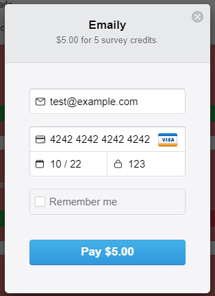
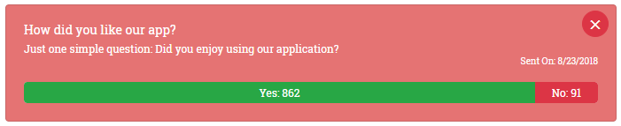

# Emaily

Emaily is an application which is lets you send surveys (via email) to thousands of people at one time. It allows you to customise the content of the email, and tracks each response to the surveys in the dashboard. Emaily is a pay-as-you-go service, where one credit can send out one batch of surveys. You can purchase 5 credits for $5.00 inside the application. You can run the application for free by following the trial payment steps below.

## Installation

If you are looking to view / make changes to the existing codebase, you should navigate to a create a suitable directory, and run `git clone https://github.com/jamesgower/emaily` from the terminal to fork the repository. Once the repository is clone, you can navigate to your created directory and run `npm install` to install all dependencies. To run the application, you should navigate into the `server` directory, and run `npm run dev`, to start both the client, and the express server concurrently.

**NOTE:**
When forking the repository, all database/API keys are removed from GitHub for security, so the application will *not* run correctly when running `npm run dev`.

## Usage

To access the application, click [this](https://emaily-full-stack.herokuapp.com/) link. It is currently being hosted on Heroku's free plan, so it may take a few seconds to load up on first launch, so please be patient while it loads.

### Logging In

When you first access the application, you will be prompted to login with your Google account. This is done securely and externally via Passport's Google OAuth 2.0. Logging in through other social media platforms such as Facebook, Twitter and GitHub are currently being developed, and will be released in the near future. Once you are logged in, you will be greeted with the dashboard page.

### Adding Credits

To be able to send surveys, you must purchase credits at a cost of $5.00 per 5 credits. To access the purchase screen, you need to click the blue "Add Credits" button in the navigation bar. To "purchase" free credits for testing/usage of the application, you should insert your email address, and insert "4242 4242 4242 4242" as the credit card number (like shown below), along with any valid expiry date and security number. Once you click "Pay $5.00", you should be redirected to the dashboard, with 5 credits appearing in the navigation bar, within a few seconds. These credits can be used to send 5 surveys (1 per survey).

### Sending Surveys

Once you're all set up with some credits on your account, you can begin to send surveys. This is done by clicking the circular red "+" button in the bottom right of the page. This will redirect you to the Survey Form page, where you can insert all of the relevant data you wish to add to your surveys. You need to add all of the recipients in the "Recipients Lists" by inputting comma separated values. You will be alerted to any errors in the recipients list below the text box. Once you are happy with all of the values, you can click the green "Next" button to go to the reviewing page. Double check all fields here, and if you are happy with them, you can click the green "Send Survey" button to send the survey to all recipients.

### Getting Feedback

When the survey recipient responds to your email, either positively or negatively, then the dashboard will visually update with these responses. Every few minutes the dashboard will update these values, and the end result can be something like this:

## Technologies

### Front-End

- Axios
- Create-React-App
- React 16
- Reactstrap
- Redux
- Redux Form
- Redux Thunk

### Back-End

- Body Parser
- Concurrently
- Cookie-Session
- Express (Node.JS)
- Local Tunnel
- Lodash
- Mongoose
- Nodemon
- Passport (Google OAuth 2.0)
- Path Parser
- SendGrid
- Stripe